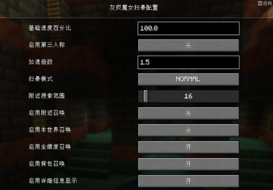
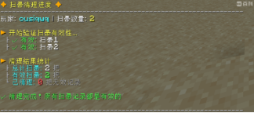
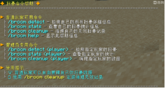

此模组为【魔女的扫帚】的非官方重制版，对代码进行了重构，并将扫帚史诗级加强（扫帚多快全靠自觉啊）。默认速度18格/秒，全维度可传，详细配置请自行设置。

目前版本：neoforge1.21.1

添加了一个魔女的扫帚物品及实体，以及魔女的帽子和衣服。

该模组以魔女之旅中伊蕾娜的扫帚为原型制作。

扫帚的操作逻辑：W/S前后、A/D转向、左alt下降 、空格上升、左ctrl加速（和疾跑一样）

右键地面即可召唤出扫帚，潜行加左键收回。\
按键盘的r键可以进行扫帚召唤，召唤范围请在配置里面修改。

扫帚的所有设置可以在：【设置→模组→ Ashen Witch Broom→配置】进行设置。

mod还为扫帚添加了多项管理指令，能管理您和您好友的扫帚群。

说明：/broom detect [player]

player为人物，不填写默认自己，填写别人需要op权限。

|指令|功能|示例|
| :- | :- | :- |
|/broom detect [player]|扫帚检测命令，能显示所有存储的扫帚详细信息||
|/broom stats [player]|扫帚统计命令，显示扫帚统计信息||
|/broom cleanup [player]|扫帚清理命令，批量验证并清理无效的扫帚记录||
|/broom help|帮助命令||
