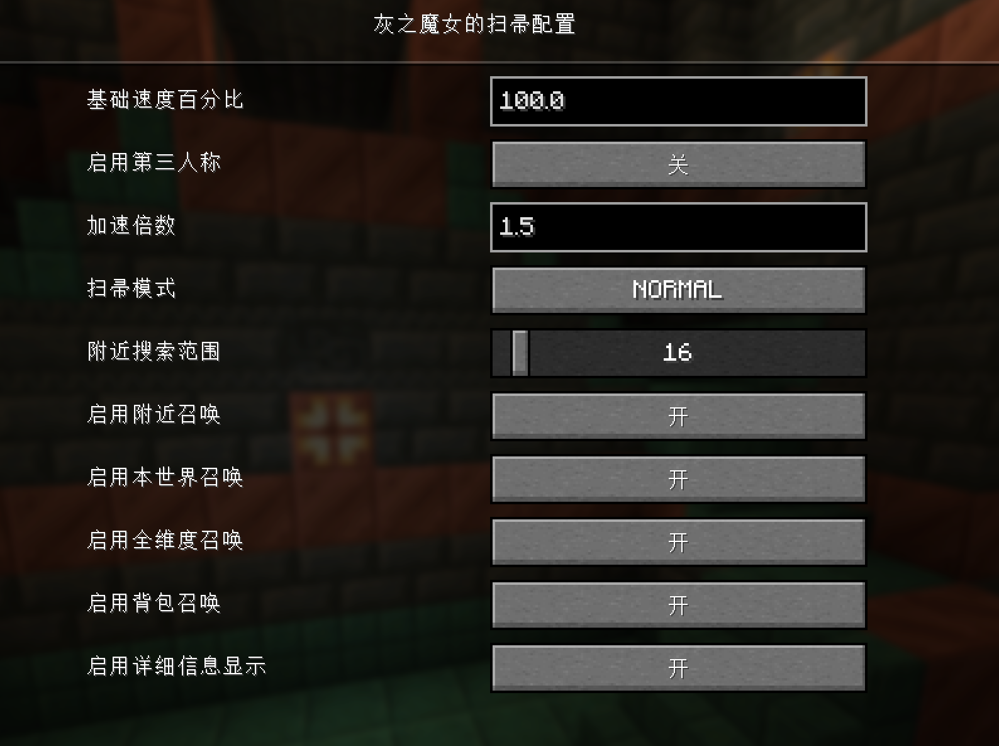
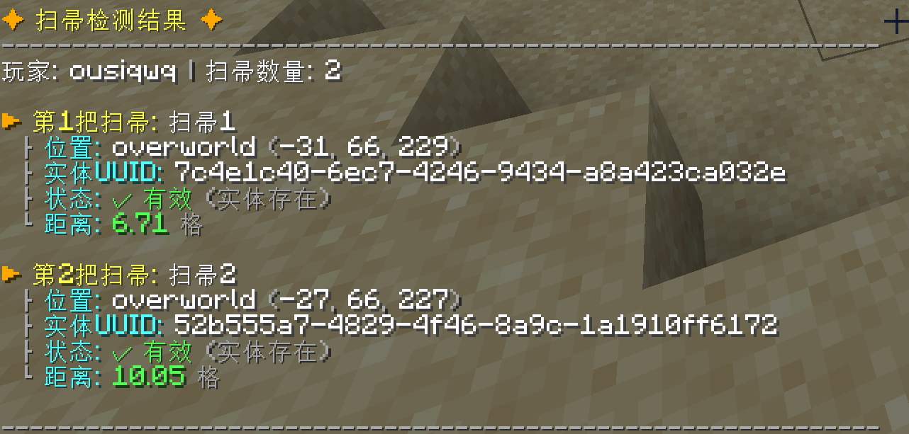
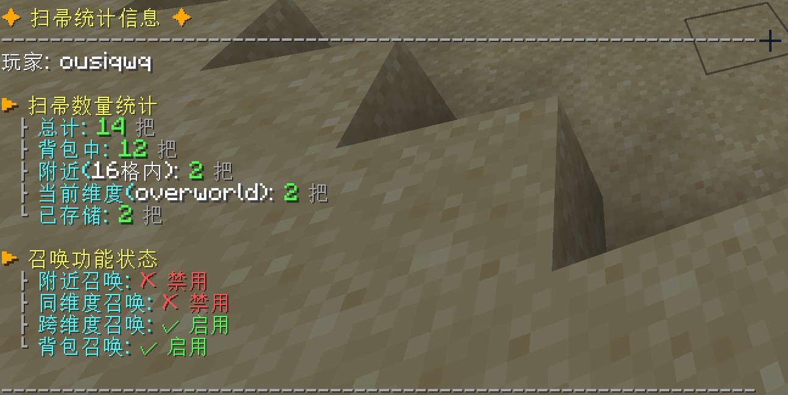
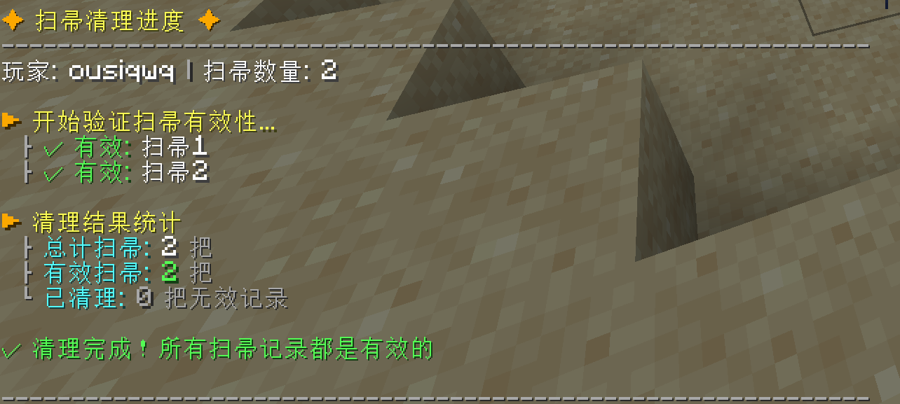
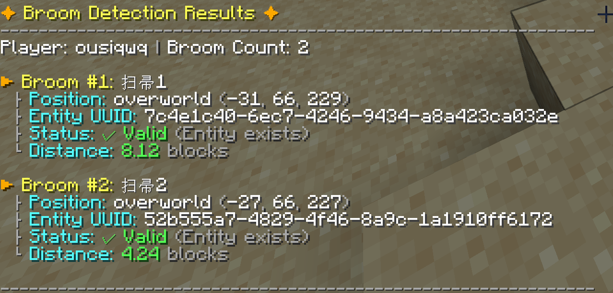
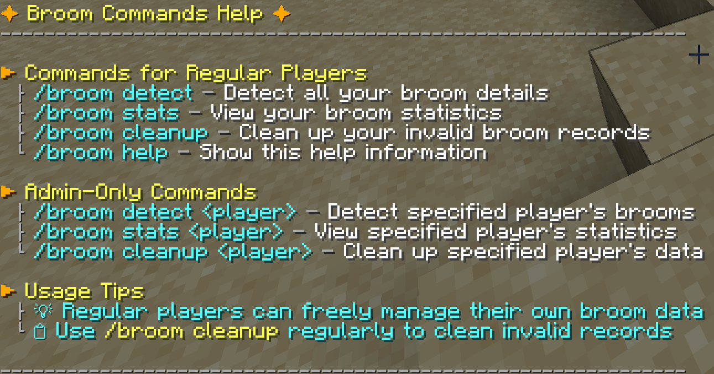

# 中文版

## 简介
此模组为【魔女的扫帚】非官方重制版，对代码进行了重构。

并将扫帚史诗级加强（扫帚多快全靠自觉啊）。

默认速度18格/秒，全维度可传，详细配置请自行设置。

## 添加的物品

添加了一个魔女的扫帚物品及实体，以及魔女的帽子和衣服。

该模组以魔女之旅中伊蕾娜的扫帚为原型制作。

## 扫帚操作逻辑

扫帚的操作逻辑：W/S前后、A/D转向、左alt下降 、空格上升、左ctrl加速（和疾跑一样）

右键地面即可召唤出扫帚，潜行加左键收回。

按键盘的r键可以进行扫帚召唤，召唤范围请在配置里面修改。

## 模组设置界面

扫帚的所有设置可以在：【设置→模组→ Ashen Witch Broom→配置】进行设置。

| 配置界面 | 扫帚模式 |
|:---:|:---:|
|  |  |

## 模组提供的指令

mod还为扫帚添加了多项管理指令，能管理您和您好友的扫帚群。

说明：/broom detect [player]

player为人物，不填写默认自己，填写别人需要op权限。

| 指令 | 功能 | 示例 |
| :--- | :--- | :--- |
| /broom detect [player] | 扫帚检测命令，能显示所有存储的扫帚详细信息 |  |
| /broom stats [player] | 扫帚统计命令，显示扫帚统计信息 |  |
| /broom cleanup [player] | 扫帚清理命令，批量验证并清理无效的扫帚记录 |  |
| /broom help | 帮助命令 |  |

## 图片展示

## 外部相关链接

MC百科：[https://www.mcmod.cn/class/21739.html](https://www.mcmod.cn/class/21739.html)

GitHub：[https://github.com/fsdbujgvr/Ashen_Witch_Broom](https://github.com/fsdbujgvr/Ashen_Witch_Broom)

CurseForge：[https://legacy.curseforge.com/minecraft/mc-mods/ashen-witch-broom](https://legacy.curseforge.com/minecraft/mc-mods/ashen-witch-broom)

Modrinth：[https://modrinth.com/mod/ashen-witch-broom](https://modrinth.com/mod/ashen-witch-broom)

***

# English Version

## Introduction
This mod is an unofficial, refactored remake of the "Witch's Broom" mod.

The broom has been epically enhanced (how fast it goes is up to you).

The default speed is 18 blocks/second, and it works in all dimensions. Please adjust the detailed settings in the configuration menu.

## Added Items

This mod adds a Witch's Broom item and entity, as well as a Witch's Hat and Clothes.

The mod is based on the broom of Elaina from "Wandering Witch: The Journey of Elaina".

## Broom Controls

Broom controls are as follows: W/S for forward/backward, A/D to turn, Left Alt to descend, Space to ascend, and Left Ctrl to accelerate (same as sprinting).

Right-click the ground to summon the broom. Sneak and left-click to retrieve it.

You can also press the 'R' key to summon the broom. The summoning range can be modified in the config.

## Mod Config Menu

All broom settings can be configured via: **Options... → Mods → Ashen Witch Broom → Config**.

| Configuration | Broom mode |
|:---:|:---:|
|  |  |

## Mod Commands

The mod also adds several commands to manage your and your friends' collections of brooms.

Note: `/broom detect [player]`

If `[player]` is not specified, it defaults to yourself. Operator permissions are required to target other players.

| Command | Function | Example |
| :--- | :--- | :--- |
| /broom detect [player] | Broom detection command. Displays detailed information for all stored brooms. |  |
| /broom stats [player] | Broom statistics command. Displays broom stats. |  |
| /broom cleanup [player] | Broom cleanup command. Batch validates and removes invalid broom records. |  |
| /broom help | Help command. |  |

## Image Showcase

## External Links

MC百科：[https://www.mcmod.cn/class/21739.html](https://www.mcmod.cn/class/21739.html)

GitHub：[https://github.com/fsdbujgvr/Ashen_Witch_Broom](https://github.com/fsdbujgvr/Ashen_Witch_Broom)

CurseForge：[https://legacy.curseforge.com/minecraft/mc-mods/ashen-witch-broom](https://legacy.curseforge.com/minecraft/mc-mods/ashen-witch-broom)

Modrinth：[https://modrinth.com/mod/ashen-witch-broom](https://modrinth.com/mod/ashen-witch-broom)
